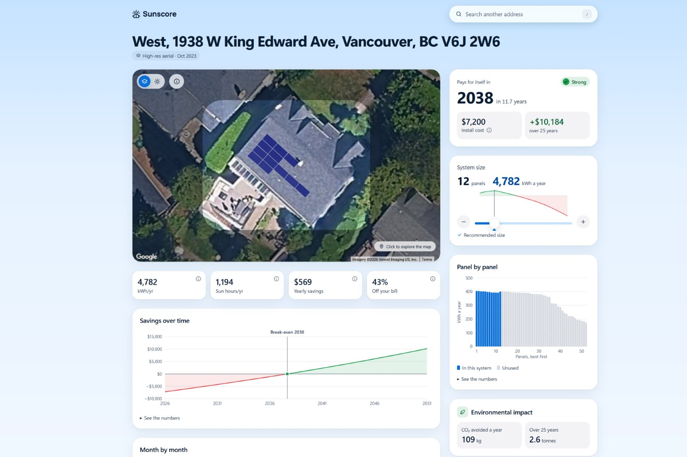
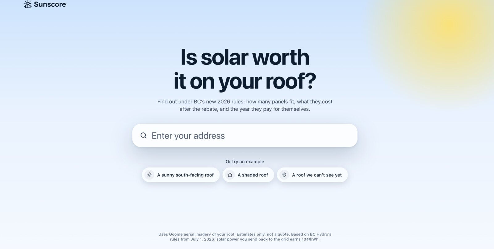
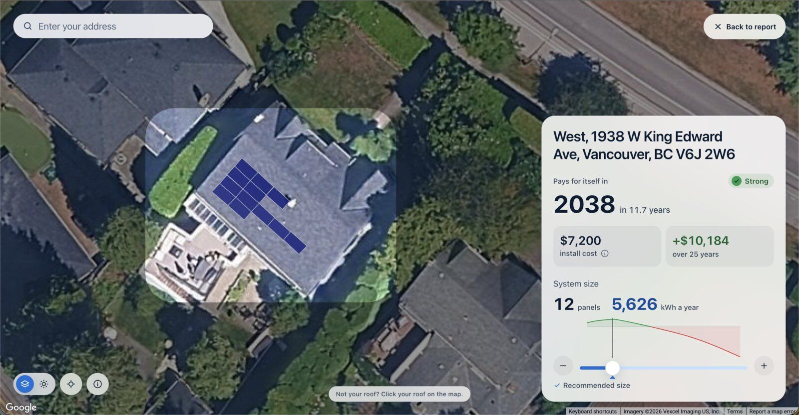
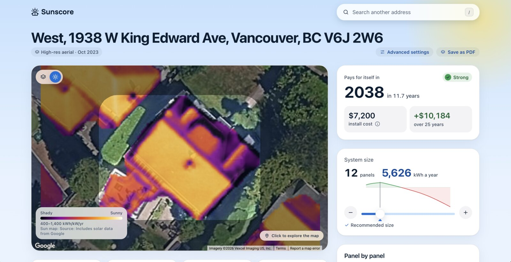
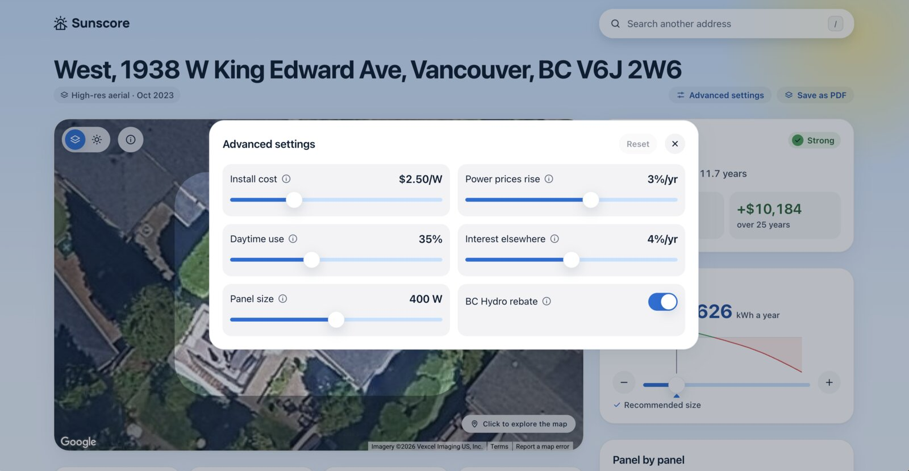
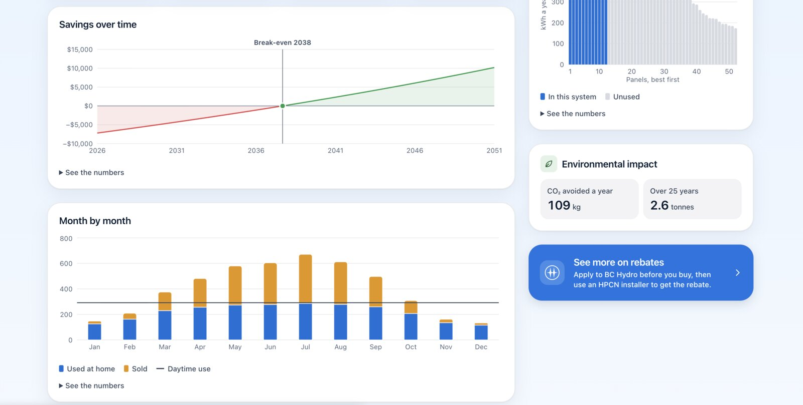

# Sunscore

Is rooftop solar worth it on your house? Type a BC address and Sunscore tells you: how many
panels fit on your actual roof, what they cost after the BC Hydro rebate, and the year they pay
for themselves.

**[Try it at sunscore.tech](https://sunscore.tech)** · [Devpost](https://devpost.com/software/solmap) · [Demo video](https://www.youtube.com/watch?v=4wyM6YDj84k)

Built in 24 hours at **StormHacks 2026** by Isaac Kehler,
Gabe MM, Kyle Maglaya and Mitchell Winter.



## Why we built it

On July 1, 2026 BC Hydro closed net metering. If you put panels up now, the power you send back
to the grid earns a flat 10¢/kWh instead of being banked at the retail rate. Power you use
yourself still saves you 12 to 14¢. That changes the math a lot: the first few panels are worth
much more than the last few, and a roof full of panels can take longer to pay off than a small
system.

Most solar calculators we found still assume the old rules, and Google's Solar API only does the
financial side for US addresses. So we wrote our own BC model and wired it to Google's roof data.

## What it does

- **Reads your real roof.** Google's Solar API gives us the roof segments, their pitch and
  direction, and where each panel would go. We draw the panels on the map, best spots first.
- **Gives a straight answer.** Strong, Moderate, Weak or Not recommended, with the reasons
  (sun hours, roof direction, shading, how much you'd be selling at 10¢). If a system never pays
  back within the 25-year panel life, it says so.
- **Picks a size for you.** It tries every layout the roof can hold and recommends the one with
  the best long-term value. Under the new rules that's usually around 5 kW, well below what most
  roofs fit, because BC Hydro's rebate stops growing at 5 kW and extra panels mostly export.
- **Lets you play with it.** Drag the size slider and the panels, payback, savings and charts all
  update instantly. Advanced settings let you change install cost, panel wattage, power price
  growth, how much of your power you use during the day, and the rebate.
- **Shows where the sun hits.** A heatmap of yearly sunlight on the roof, so shading is obvious.
- **Handles the gaps.** Roofs Google hasn't mapped get a clear "we can't see this roof yet" page
  instead of a broken one, and there's a print view if you want to take the report to an installer.

| | |
|---|---|
|  |  |
| Landing page | Map view (click "Not your roof?" to pick a different building) |
|  |  |
| Sun heatmap | Advanced settings |
|  | |
| Savings over time and month by month | |

## How the numbers work

The full model, with every formula and source, is in [docs/FINANCIAL_MODEL.md](docs/FINANCIAL_MODEL.md).
The short version:

1. Start from Google's yearly DC production for each panel layout and convert to usable AC (×0.85).
2. Split it into power you use yourself and power you export. Self-use follows a curve that levels
   off at your daytime usage, so bigger systems export a bigger share at 10¢.
3. Price the savings against BC Hydro's real tiered or flat rate (Rate Schedules 1101/1151) and the
   export rate (RS 2289).
4. Cost is $/W installed minus the rebate: $1,000 per kW, capped at $5,000 and at half the cost.
5. Run it for 25 years with panel degradation and rising power prices, then work out payback,
   lifetime savings and NPV.

Every BC number (rates, rebate, costs) lives in [`src/config/bc.ts`](src/config/bc.ts) next to the
link we got it from and the date we checked it. The model is plain TypeScript with no network calls,
so it runs in the browser on every slider move, and it's checked against hand-worked
[golden cases](fixtures/finance-golden.json).

A note on CO₂: BC's grid is almost all hydro, so solar here doesn't cut emissions the way it would
somewhere that burns coal or gas. Treat the environmental numbers as small and rough.

## How it's built

**Next.js 16** (App Router) with React 19 and TypeScript, Tailwind and shadcn/ui, the Google Maps
JavaScript API with Places autocomplete, Recharts for the charts and Zod for validation. It runs as
a Docker container on a small VPS behind Caddy and Cloudflare.

```
Browser
  ├─ Google Maps + Places (browser key, locked to our domain)
  ├─ lib/finance: the BC model, recalculated on every slider move
  └─ /api/solar/* ───────────────┐
                                 ▼
Next.js server
  ├─ /api/solar/building  → Solar API buildingInsights, trimmed to only what we render
  ├─ /api/solar/layers    → Solar API dataLayers; GeoTIFFs downloaded and decoded here
  ├─ /api/solar/heatmap   → PNG drawn from those rasters, so the browser never sees a GeoTIFF or the key
  └─ cache: memory → disk (deleted after 25 days) → Google
```

Some things we're happy with:

- **Nobody needed an API key to work on it.** We hand-made a set of fake roofs in the exact shape
  of Google's responses (south-facing, shaded, flat, east-west, tiny, apartment block). With
  `SOLAR_SOURCE=fixtures` the whole app runs on those, which is also what CI uses. Real Google
  data only came in once the UI already worked.
- **Following Google's terms.** Google lets you cache Solar data for up to 30 days. We keep it for
  25, stamp every file with when we fetched it, and sweep old ones hourly. No real responses are
  committed to the repo or baked into the image. The Solar key never leaves the server.
- **Keeping the bill under control.** Each roof costs one Google call, then it's cached. There are
  per-IP rate limits and daily caps per endpoint, so a busy demo room can't run up a surprise bill.
- **Tests.** Over 400 Vitest tests across the finance model, the API response parsing, the cache, the
  map geometry and the report state, plus Playwright smoke tests. CI runs typecheck, lint, tests and
  a production build on every PR, and `main` deploys itself.

### How we split the work

Four people, four areas: map and geometry, API and infrastructure, the finance model, and the report
UI. Before writing any app code we agreed on the shared types in [`src/types/app.ts`](src/types/app.ts)
(what the server sends, what the finance engine takes and returns), so everyone could build against
fixtures in parallel and plug together at checkpoints. The planning docs we worked from are in the
repo: [PLAN.md](PLAN.md) for scope and timeline, [DESIGN.md](DESIGN.md) for screens and verdict
rules. We used Claude Code a lot, with a shared [CLAUDE.md](CLAUDE.md) so everyone's sessions
followed the same rules.

## Running it locally

You need Node 22 and pnpm.

```bash
pnpm install
cp .env.example .env.local
pnpm dev
```

Open http://localhost:3000 and click one of the example roofs. That works with no keys at all: the
server uses the built-in fake roofs and the map shows in Google's "development mode".

To search real addresses, add a Google Maps key (Maps JavaScript API and Places API (New)) as
`NEXT_PUBLIC_MAPS_API_KEY`. To pull real roof data, add a Solar API key as `SOLAR_API_KEY` and set
`SOLAR_SOURCE=cache`. `.env.example` explains every option.

```bash
pnpm test        # unit tests
pnpm typecheck
pnpm lint
pnpm build
pnpm test:e2e    # Playwright
```

## What's in the repo

| Path | What it is |
|---|---|
| `app/` | Pages (landing, report) and the `/api/solar/*` routes |
| `components/` | Map, report cards, charts and inputs |
| `lib/finance/` | The BC financial model: bills, 25-year projection, recommended size, verdict |
| `lib/solar/` | Google Solar API client, response parsing, cache, rate limits, heatmap rendering |
| `lib/geo/` | Panel and roof geometry for the map |
| `src/config/bc.ts` | Every BC rate, rebate and cost, with sources |
| `src/types/` | Google's response types and our own shared types |
| `fixtures/` | The fake roofs and the golden finance cases |
| `docker/`, `ops/`, `.github/workflows/` | Docker image, the server's compose file, CI and deploy |
| `docs/` | [Financial model](docs/FINANCIAL_MODEL.md), [Solar API notes](docs/SOLAR_API.md), [infrastructure](docs/INFRA.md) |

"Solmap" was our working name, so you'll still see it in a few places (the Docker image, env vars
like `SOLMAP_TAG`).

## What's next

- Rates and rebates for other provinces, and eventually other countries.
- Panels plus a battery, compared against panels alone.
- Detecting panels that are already on a roof, to show how an existing system could be expanded.
- Letting people upload their own BC Hydro usage history instead of estimating it from a bill.

## Notes

Sunscore gives estimates, not quotes. Talk to a BC Hydro-approved installer before buying anything,
and apply for the rebate before you install.

Roof and sunlight data: Source: Includes solar data from Google. Map imagery © Google and its
providers. BC Hydro rates and rebate rules are linked from [`src/config/bc.ts`](src/config/bc.ts).
